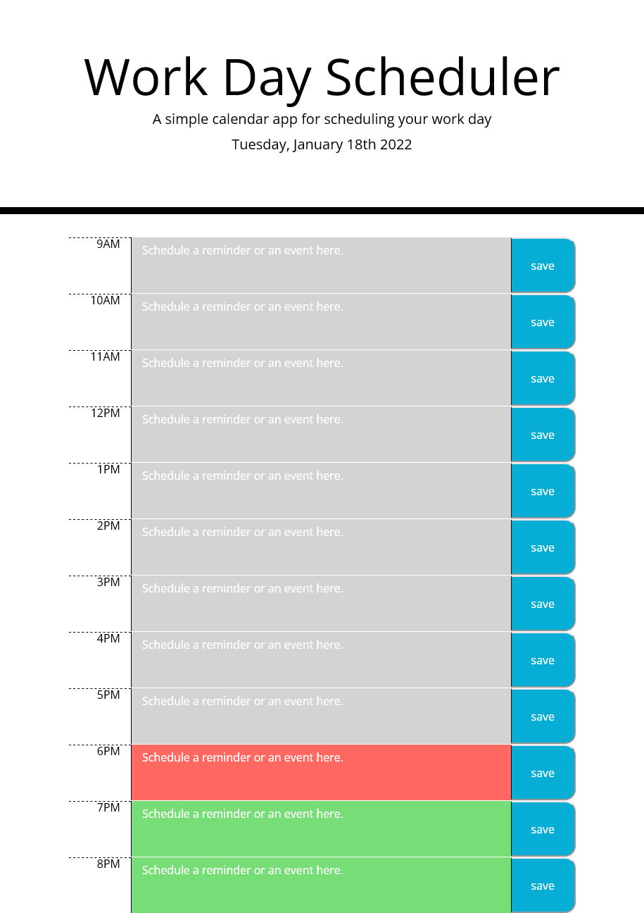

# Every Day

* Webpage deployed link: https://andrev96.github.io/Every_Day/

* GitHub repository link: https://github.com/AndreV96/Every_Day/

## List of technologies used:

* HTML/CSS

* JavaScript

## Screenshot

The following image shows the web application's appearance and functionality:

## Description

The purpose of this webpage is to create a "Work Day Scheduler" which is a tool where you can store the reminders/activities/events that you have planned for your day so you can review them at any moment. In the webpage you will be presented with hour blocks from 9 am to 9 pm, each is color coded in real time to show wich blocks have been passed in time, which one is the present and which ones are in the future. In each hour block you have a text area where you can write your reminder/activity/event so you can organiza your day schedule. Next to each block there is a save button where you can store the text you just entered in your local storage. Then when you open again the webpage all your blocks will be displayed as you wrote them. Each block can be overwritten and edited at any time as long as it is saved afterwards. Also on the top you are able to see which day of the week is current and the date.

The purpose of creating this webpage was to practice local storage, connection with API tools like Jquery, Bootstrap and Moment that interact in real time with the information in the webpage. In this case so the webpage can keep track of each hour of the day that passes through Moment. This helped me a lot to understand better how API connections are made and how can they be useful. Also I learned more about local storage and what can be done with it to solve issues. 

### License: MIT

Contact information:

* Email: ventaslederer@hotmail.com

* Github: https://github.com/AndreV96/

